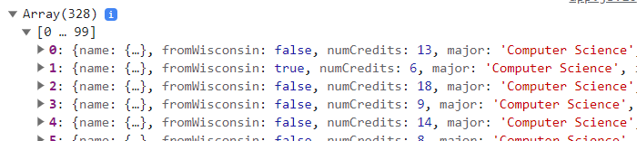
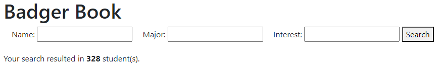
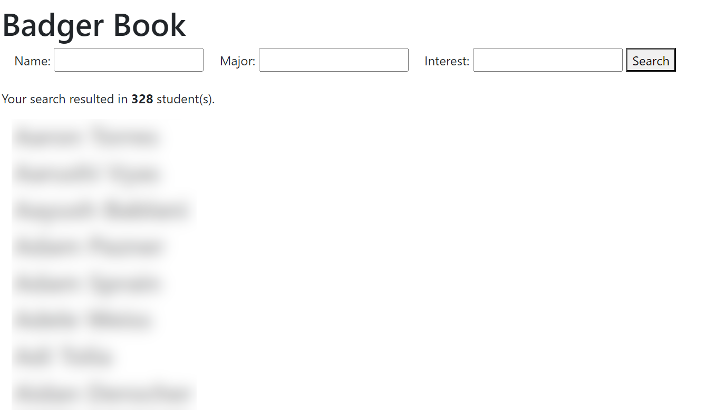
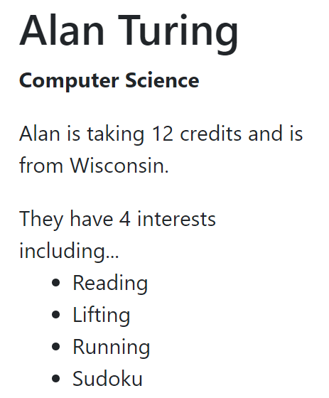
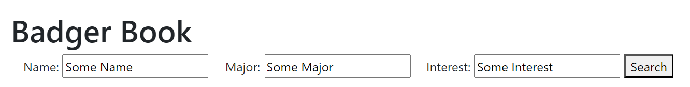
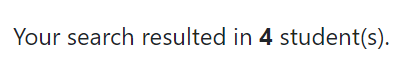
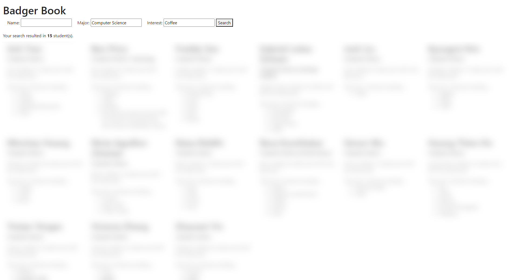

# CS571-F23 HW2: Badger Book

Welcome to Badger Book! In HW0, we collected JSON data about you; in this assignment, you will present this JSON data on a webpage: Badger Book. You'll fetch data from the API, present it on a webpage, and provide search functionality to speed up the introduction process!

**Note:** If there were issues with your submission or if you had joined the class late, you may not see yourself in the data -- sorry!

## Important

**Note:** For this assignment, you may *only* modify `app.js`. You may *not* modify `index.html`. You will implement the logic in `app.js` to fetch and filter student data to manipulate the DOM of `index.html`.

## Tasks

### 1. Fetch Student Data

Fetch the student data from `https://cs571.org/api/f23/hw2/students`. Note that this requires a `X-CS571-ID` header specifying your unique Badger ID. Do **NOT** hardcode your Badger ID, use `CS571.getBadgerId()` (see HW1 for an example). After fetching this data, `console.log` the contents of this array.

### 2. Show # of Students

Upon fetching student data, use `document` to update the element with id `num-results` to be the number of students in the course. You can use the [innerText](https://developer.mozilla.org/en-US/docs/Web/API/HTMLElement/innerText) attribute to change the text within `num-results`.

### 3. Displaying Student Names

With this data, display the students' names on the webpage. The helper function `buildStudentsHtml` will return HTML for all student names. Then, you can insert this HTML into the 'students' div of the webpage using [innerHTML](https://developer.mozilla.org/en-US/docs/Web/API/Element/innerHTML).

We will talk about the security implications of `innerHTML` in class.

### 4. Add Other Student Data

There's more to a student than just their name! Modify `buildStudentHtml` to display all of the other information about a student. How you choose to do this is up to you, but you must display...
 - first & last name
 - major
 - number of credits
 - if they are from WI
 - their interests **in ul list format** and **their number of interests**

### 5. Search Functionality
With all of the data being displayed, we need to provide the user with a way to narrow down their results. Implement search functionality so that a user may search by name, major, and interests when clicking the "search" button. After clicking "search", the only students that should be displayed are those that match the search criteria.

Be sure to put your search logic within `handleSearch`.

The following are requirements of the search functionality...
 - search terms are case-insensitive, e.g. searching "cat" should yield results with "cAT"
 - search terms are substrings, e.g. "olo" should yield results with "color"
 - search terms are AND expressions, e.g. searching for a name of "Cole", a major of "Computer Science", and an interest of "coffee" should only yield Coles studying computer science who are interested in coffee
 - searching "john", "smith", "john smith", or "ohn smi", should all yield the person named "John Smith"
 - if any interest matches the search term, it should be considered a result, e.g. searching "bow" should yield people with interests in "bow hunting", "bowling", or "formal bowing".
 - if a search term is left blank it should not affect the results of the search
 - leading and trailing spaces of search terms should be ignored

A user should be able to search many times! For example, if a user searches "Cole" followed by "John", accurate results should be shown for both searches.

I would *encourage you* but not *require you* to use declarative over imperative programming.

**Note:** There are no Alan Turings, John Smiths or Cole Nelsons in the data, these are just examples.

### 6. Update Num Results

Upon searching, `num-results` should be updated to the number of matching students.

### 7. Formatting Student Data

This all "works"... but the formatting is hard to read. Use [Bootstrap's grid system](https://getbootstrap.com/docs/4.0/layout/grid/) so that...
 - 1 column of students is shown on `xs` devices
 - 2 columns of students is shown on `sm` devices
 - 3 columns of students is shown on `md` devices
 - 4 columns of students is shown on `lg` devices
 - 6 columns of students is shown on `xl` devices

You can re-size your browser window to test this.

**Hint:** You will want to (1) add the `row` css class to the "students" div by modifying the element's [className](https://developer.mozilla.org/en-US/docs/Web/API/Element/className), and (2) give each student div a `col` class that is responsive based on the size of the device.

### Done! 🥳

Congrats! Add, commit, and push your files to GitHub Classroom and paste your commit hash in the Canvas assignment.
