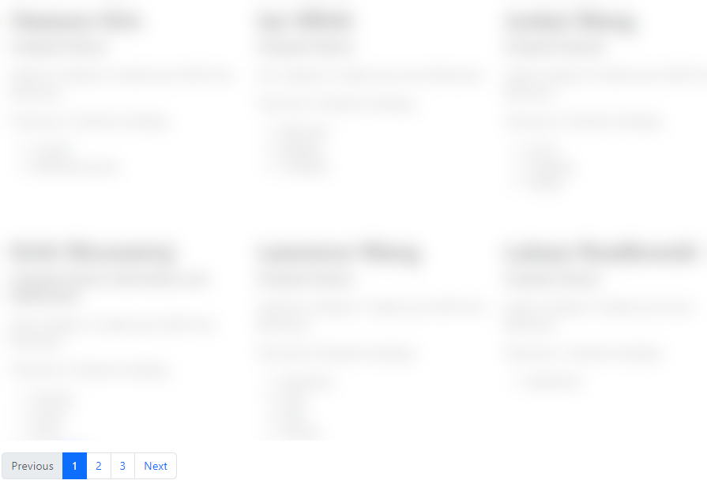

[](https://classroom.github.com/online_ide?assignment_repo_id=12197890&assignment_repo_type=AssignmentRepo)
# CS571-F23 HW4: Badger Book (React!)

Welcome back to Badger Book -- React Edition! In HW0, we collected JSON data about you; in HW2 we implemented Badger Book using vanilla HTML, CSS, and JS; and in this assignment, you will create Badger Book as a React App. Just like in past homeworks, you'll fetch data from the API, present it on a webpage, and provide search functionality to speed up the introduction process! Both the "programming" and "design" aspects of the assignment will be completed with React.

**Note:** A duplicate student was removed from the original dataset -- there are now 327 students.

## Setup

The starter code provided to you was generated using [vite](https://vitejs.dev/guide/). Furthermore, [bootstrap](https://www.npmjs.com/package/bootstrap) and [react-bootstrap](https://www.npmjs.com/package/react-bootstrap) have already been installed. **You should *not* re-run the  npm create vite command**. Instead, in this directory, simply run...

```bash
npm install
npm run dev
```

Then, in a browser, open `localhost:5173`. You should *not* open index.html in a browser; React works differently than traditional web programming! When you save your changes, they appear in the browser automatically. I recommend using [Visual Studio Code](https://code.visualstudio.com/) to do your development work.

The two components you will be working on are located in the `components` folder. I have created the skeleton for `Student.jsx` and `Classroom.jsx`. The classroom component should fetch all of the data from the API and display them as student components.

## Tasks

### 1. Fetch Student Data

In `Classroom.jsx`, create a React state variable that will hold the array of student data. Then, fetch the student data from `https://cs571.org/api/f23/hw4/students` *on page load* and save it to this React state variable. Note three things...
 1. You'll likely need to use the React hooks `useEffect` and `useState`.
 2. This is the same data from the HW2 API *except* an additional unique "id" has been added to each student.
 3. This request requires a `X-CS571-ID` header specifying your unique Badger ID.
 
After fetching this data, `console.log` the contents of this array.

**Hint:** Are you getting a [429 HTTP code](https://developer.mozilla.org/en-US/docs/Web/HTTP/Status/429) from the server? Check your code for an infinite loop! You will be automatically locked out of the API for up to 1 minute.


### 2. Display # of Students

In `Classroom.jsx`, display the number of students returned below the search form; for example...

```
There are NUMBER student(s) matching your search.
```


### 3. Displaying Student Names

In `Classroom.jsx`, display a `Student` component for each student, passing down props of the student's data. You must display the student's data using the `Student` component.

Furthermore, make sure to specify a unique `key` for each student; you should use the student's ID as the key. You should make sure that you are **not** getting an error saying `each child in a list should have a unique "key" prop.` in your browser's console log, you will lose points!


### 4. Formatting Student Data

This "works"... but there is a lot of wasted space on large devices. In `Classroom.jsx`, use [React-Bootstrap's grid system](https://react-bootstrap.github.io/layout/grid/) so that...
 - 1 column of students is shown on `xs` devices
 - 2 columns of students is shown on `sm` devices
 - 3 columns of students is shown on `md` devices
 - 4 columns of students is shown on `lg` devices
 - 6 columns of students is shown on `xl` devices

You can re-size your browser window to test this.


### 5. Add Other Student Data

There's more to a student than just their name! Modify `Student.jsx` to display all of the other information about a student (except for their ID). How you choose to do this is up to you, but you must display...
 - first & last name
 - major
 - number of credits
 - if they are from WI
 - their interests **in ul list format** and **their number of interests**


Furthermore, make sure to specify a unique `key` for each interest; you can assume that each interest is unique per person. You should make sure that you are **not** getting an error saying `each child in a list should have a unique "key" prop.` in your browser's console log, you will lose points!


### 6. Search Functionality

With all of the data being displayed, we need to provide the user with a way to narrow down their results. Implement search functionality so that a user may search by name, major, and interests with results appearing **as they type**  -- *there is no search button*. Only students that match the typed search criteria should be displayed.

**Hint**: You will likely need to create a React state variable for each of the search terms to control their input in `Classroom.jsx`. Then, you can use `useEffect` to trigger a function whenever these search terms change. You may also choose to introduce another React state variable such as `shownStudents` in addition to what you did in Step 1.

How you implement this in React is up to you, but the following are requirements of the search functionality **(these are the same as in HW2)**...
 - search terms are case-insensitive, e.g. searching "cat" should yield results with "cAT"
 - search terms are substrings, e.g. "olo" should yield results with "color"
 - search terms are AND expressions, e.g. searching for a name of "Cole", a major of "Computer Science", and an interest of "coffee" should only yield Coles studying computer science who are interested in coffee
 - searching "john", "smith", "john smith", or "ohn smi", should all yield the person named "John Smith"
 - if any interest matches the search term, it should be considered a result, e.g. searching "bow" should yield people with interests in "bow hunting", "bowling", or "formal bowing".
 - if a search term is left blank it should not affect the results of the search
 - leading and trailing spaces of search terms should be ignored


I would *encourage you* but not *require you* to use declarative over imperative programming.

**Note:** There are no Alan Turings, John Smiths or Cole Nelsons in the data, these are just examples.

**Important:** The displayed number of results (see Step 2) should also be updated to reflect the number of students found.


### 7. Reset Search

In `Classroom.jsx`, add an `onClick` handler so that when the user clicks the "Reset Search" button, the search term fields should be cleared and all students should be displayed.

**Important:** The displayed number of results (see Step 2) should also be updated to reflect the total number of students.


### 8. Basic Pagination

[Implement pagination using Bootstrap](https://react-bootstrap.netlify.app/docs/components/pagination/).

Up to 24 results should be shown per page. Allow the user to switch between pages via numbered paginated items at the bottom of the page (e.g. 1, 2, 3, 4, etc.). Indicate which page the user is currently on by marking that paginated item as active. When any of the search terms are updated, or if the search is reset, return the user to Page 1.


### 9. Next & Previous Buttons

In addition to the numbered paginated items, add "Previous" and "Next" buttons. The "Previous" button should be disabled if the user is on the first page, and the "Next" button should be disabled if the user is on the last page. If there are no results, both buttons should be disabled.



### Done! 🥳

Congrats! Add, commit, and push your files to GitHub Classroom and paste your commit hash in the Canvas assignment.
