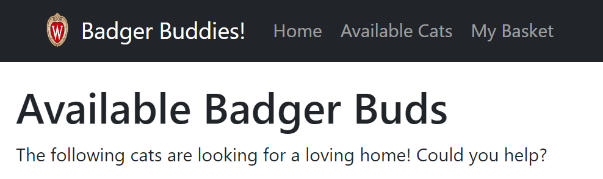
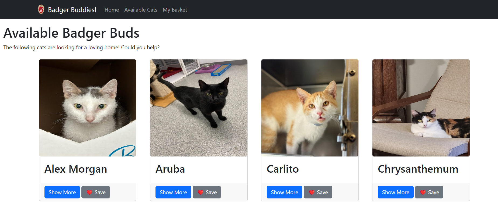
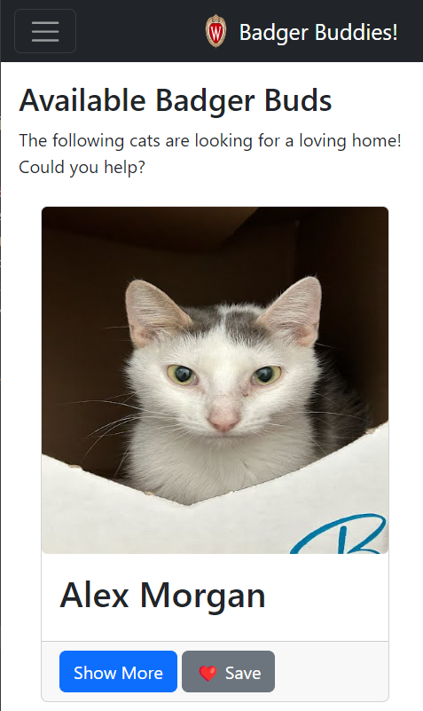
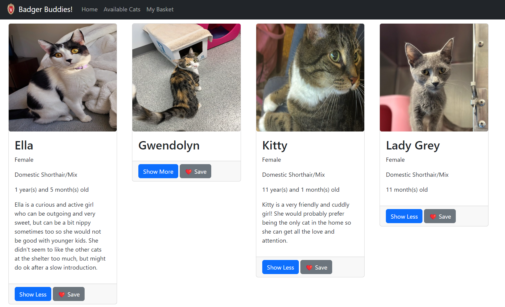
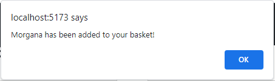
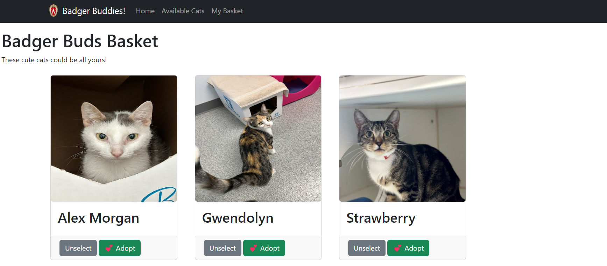
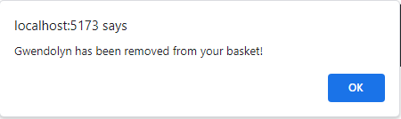
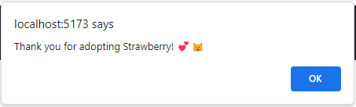
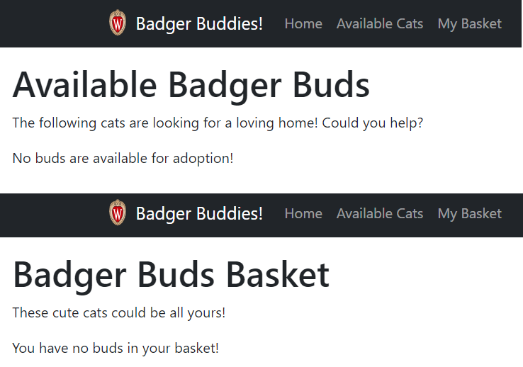
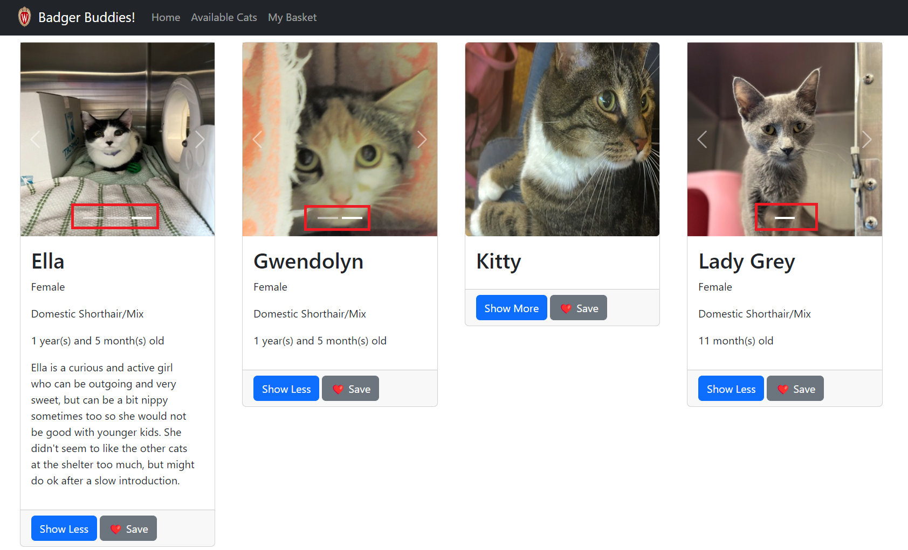

# CS571-F23 HW5: Badger Buddies

Welcome to Badger Buddies! In this homework, we will practice using multiple pages, state management, and various Bootstrap components with data from [The Madison Cat Project](https://www.madisoncatproject.org/). These are real cats looking for homes! 🐱

## Setup

The starter code provided to you was generated using [vite](https://vitejs.dev/guide/). Furthermore, [bootstrap](https://www.npmjs.com/package/bootstrap), [react-bootstrap](https://www.npmjs.com/package/react-bootstrap), and [react-router](https://www.npmjs.com/package/react-router) have already been installed. **You should *not* re-run the  npm create vite command**. Instead, in this directory, simply run...

```bash
npm install
npm run dev
```

Then, in a browser, open `localhost:5173`. You should *not* open index.html in a browser; React works differently than traditional web programming! When you save your changes, they appear in the browser automatically. I recommend using [Visual Studio Code](https://code.visualstudio.com/) to do your development work.

The components you will be working on are located in the `components` folder.

## Tasks

### 1. Setup Routes

In `BadgerBudsRouter.jsx`, add routes so that...
 - Navigating to `/available-cats` routes to `BadgerBudsAdoptable.jsx`
 - Navigating to `/basket` routes to `BadgerBudsBasket.jsx`
 - Navigating to any other route (e.g. `/bogus`) routes to `BadgerBudsNoMatch.jsx`

If you implemented these correctly, you should be able to use the navbar at the top of the webpage!



### 2. Display Adoptable Buddy Data

On the "Available Cats" page (`BadgerBudsAdoptable.jsx`), display...

 - a picture (with appropriate alt tag, e.g. "A picture of Smokey")
 - a name
 - a "show more" button (see Step 4)
 - a "save" button (see Step 5)

... for each of the buddies available for adoption.

Each buddy will have atleast 1 picture. The `src` for the image can be found by using `https://raw.githubusercontent.com/CS571-F23/hw5-api-static-content/main/cats/CAT_IMG_ID"` where `CAT_IMG_ID` is replaced with its image ID, e.g. [https://raw.githubusercontent.com/CS571-F23/hw5-api-static-content/main/cats/38480c82-d172-480d-8117-81b63ca6d41f.jpg](https://raw.githubusercontent.com/CS571-F23/hw5-api-static-content/main/cats/38480c82-d172-480d-8117-81b63ca6d41f.jpg)

Please note that...

 - **YOU MUST** create a component (e.g. `BadgerBudSummary.jsx`) to display this data.
 - **YOU MUST** specify a `key` for each buddy.
 - **YOU MAY NOT** `fetch` data.

The `fetch` has already been done for you in `BadgerBuds.jsx`. Instead of fetching data, you must use the `BadgerBudsDataContext`. This context returns an array with all the badger buddy data.



### 3. Make Display Responsive

Use [React-Bootstrap's grid system](https://react-bootstrap.github.io/layout/grid/) so that your design is responsive. There are no strict requirements for which breakpoints to use, but your design should display more columns on larger devices. Try resizing your window to test this.



### 4. Display Additional Details

Upon clicking the "show more" button, additional details should be shown for the buddy including...

 - gender
 - breed
 - age\*
 - a description *if they have one* (not all buddies have a description!)

\* The age is given in months and should be pretty-printed such that...
   - if the age is 4, "4 month(s) old" should be displayed.
   - if the age is 31, "2 year(s) and 7 month(s) old" should be displayed.
   - if the age is 48, "4 year(s) old" should be displayed.

**Important:** The "show more" button should become a "show less" button. When "show less" is clicked, the card should go back to showing just the cat's name, picture, "show more" button, and "save" button.

**Note:** To keep the assignment short, we won't do anything with the `spayed`, `neutered`, or `declawed` data. If you would like to display these you may, but it is not required.



### Step 5: Save Buddies

When a user clicks the "save" button for a particular buddy, an `alert` should appear stating that `CAT_NAME has been added to your basket!` to notify the user. Furthermore, that buddy should no longer be shown on the "Available Cats" page. *This should happen immediately -- the user should not need to refresh the page.*

You **MUST** implement this using `sessionStorage`. I would recommend creating a `sessionStorage` item such as `savedCatIds` to keep track of which cats have been saved to the user's basket.

By using `sessionStorage`, `savedCatIds` will only be cleared when the user closes their browser.



### Step 6: Display Saved Buddies

Only buddies that have been saved should appear in "My Basket".

In "My Basket", display...

 - a picture (with appropriate alt tag, e.g. "A picture of Smokey")
 - a name
 - an "unselect" button (see Step 7)
 - an "adopt" button (see Step 8)

... for each saved buddy. You may choose to re-use the component you made in Step 2, or you may choose to make a new one. Notice that there is no "show more" button for buddies on the "My Basket" page.

Again, **you must** specify a `key` for each buddy and **you must** use the `BadgerBudsDataContext` rather than `fetch`.



### Step 7: Unsaving Buddies

A user clicking "save" is not a commitment; they can choose to unsave a buddy by clicking the "unselect" button from the "My Basket" page.

When a user clicks the "unselect" button for a particular buddy, an `alert` should appear stating that `CAT_NAME has been removed from your basket!` to notify the user. Furthermore, that buddy should no longer be shown on the "My Basket" page, it should be returned to the "Available Cats" page. *This should happen immediately -- the user should not need to refresh the page.*

You **MUST** implement this using `sessionStorage`. I would recommend updating `savedCatIds` by removing the bud's ID from this list.



### Step 8: Adopt Buddies

A user clicking "adopt" IS a commitment.

When a user clicks the "adopt" button for a particular buddy, an `alert` should appear stating that `CAT_NAME has been adopted!` to notify the user. Furthermore, that buddy should no longer be shown on *either* the "Available Cats" or the "My Basket" pages. *This should happen immediately -- the user should not need to refresh the page.*

You **MUST** implement this using `sessionStorage`. I would recommend creating a new  `adoptedCatIds`  to keep track of the buds that are adopted.

**Note:** There is no way to "unadopt" a cat through our UI. Nor should you! 😿 Once the user has clicked "adopt", the only way `adoptedCatIds` can be reset is by closing the browser.



### Step 9: Handle No Buds

On the "Available Cats" page, if there are no available buds (e.g. all have been saved or adopted), display "No buds are available for adoption!"

Likewise, on the "My Basket" page, if there are no saved buds, display "You have no buds in your basket!"



### Step 10: Display a Carousel

When a buddy is in its "show more" mode, the single picture should be replaced with a [carousel](https://react-bootstrap.netlify.app/docs/components/carousel/) of pictures. When the user chooses "show less", it should go back to a single picture. Some carousels may only have a single picture -- that is okay!



### Design Requirements

 - Be sure that your design is responsive.
 - Be sure that images are not extremely distorted; considering using an [aspect-ratio](https://developer.mozilla.org/en-US/docs/Web/CSS/aspect-ratio) of `"1/1"`
 - Be sure that all `img` have been given an appropriate `alt` tag.


### Done! 🥳

Congrats! Add, commit, and push your files to GitHub Classroom and paste your commit hash in the Canvas assignment.
