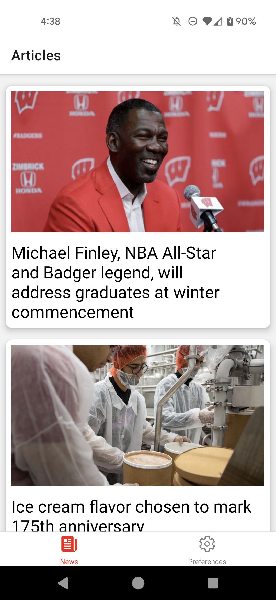
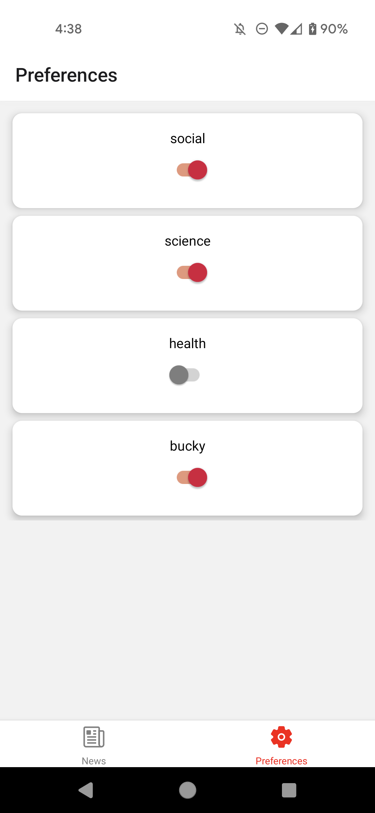

# CS571-F23 HW8: Badger News

Welcome to Badger News! For this assignment, you will complete a mobile application that allows badgers to get and customize news from their university using just a few taps on their phone!

Following, you will answer questions related to mobile design.  **Make sure to complete both parts of this assignment.**

## Badger News

The starter code provided to you was generated using [expo](https://expo.dev/) and all the necessary libraries for [react navigation](https://reactnavigation.org/) have already been added. See the `package.json` for details. **You should *not* re-run the expo init command**. Instead, in this directory, simply run...

```bash
npm install
npm start
```

To test your app, you have a few options. If you have a smart device, I would recommend using the expo app for [iOS](https://apps.apple.com/us/app/expo-go/id982107779) or [Android](https://play.google.com/store/apps/details?id=host.exp.exponent&hl=en_US&gl=US). You can scan the QR code using your phone, or you can launch commands via the terminal. Otherwise, you can use an emulator (such as [AVD](https://developer.android.com/studio/run/emulator)). Do not use the web browser to test your code; you must test on Android or iOS!

Note that we are writing code in JavaScript for React Native; if you begin writing code in Objective-C, Swift, Java, or Kotlin you are likely doing something *very* wrong!

### API Notes

All data can be retrieved via API calls to `https://cs571.org/api/f23/hw8/`. A brief overview of the API is provided below. There is no further documentation as this API only supports `GET` requests. Please use Postman to explore the API in greater depth.

`https://cs571.org/api/f23/hw8/articles` returns a short summary of each of the news articles including an `id`, `img`, `title`, `tags`, and `fullArticleId`. You may assume the `id` is unique for each article. The `fullArticleId` is also unique and can be used to fetch additional details below.

`https://cs571.org/api/f23/hw8/article?id=ARTICLE_ID` returns the details for a particular article id (from the `fullArticleId` above). **This endpoint is intentionally slow.** These details include all of the properties of the short summary as well as additional `body`, `author`, `posted`, and `url` properties. In particular...

 - `body` is a `list` of `string` where each item is a paragraph
 - `author` is a `string` of the author of the article
 - `posted` is a `string` representing the date the article was posted
 - `url` is `string` linking to the real article on [news.wisc.edu](https://news.wisc.edu/)

 The `img` may be appended to `https://raw.githubusercontent.com/CS571-F23/hw8-api-static-content/main/articles/` to get the requested image, e.g. the image `many_bucky.jpg` is hosted at `https://raw.githubusercontent.com/CS571-F23/hw8-api-static-content/main/articles/many_bucky.jpg`

### 1. Use React Navigation

Allow the user to navigate between two tabs: a tab for "News" and a tab for "Preferences". I would recommend using a BottomTabNavigator in `BadgerTabs.jsx` to navigate between screens for `BadgerNewsScreen.jsx` and `BadgerPreferencesScreen.jsx`. You may provide icons for and/or style the tabs, but it is not a requirement. **However, you must use React Navigation.**


### 2. Display News

Fetch the short news article summaries from `https://cs571.org/api/f23/hw8/articles` and display them to the screen as a card, including their image and title text. I'd recommend creating a component such as `BadgerNewsItemCard` to display each short summary as a card. Use the article's `id` as the unique key.

You may find the `BadgerCard` from lecture helpful here.



### 3. Read News Article

When a news story is selected, the user should be able brought to another screen using *a nested Stack Navigator*. This screen should show the author, posting date, and body paragraphs fetched from `https://cs571.org/api/f23/hw8/article?id=ARTICLE_ID`. Be sure that only the "Article" header bar is shown. We will add the URL in Step 5.

Additionally, the user should be displayed a message along the lines of "The content is loading!" while waiting for the body paragraphs to load. Furthermore, loading the additional content of the article must be *animated*. It may fade in, grow in size, or do some animation using `Animated` or some other third-party library. After finishing reading the article, the user should be able to to return to the list of short summaries. If they re-visit the story, the animation should occur again.


### 4. Apply Preferences

The user should be able to apply their news preferences via the "Preferences" tab. This tab should display switches (**on:** opt in, **off:** opt out) for each of the unique tags. You may **NOT** hardcode the list of unique tags; instead, you must iterate over all of the tags of the story summaries to create this list.

By default, the user should opt in to all content. However, the user should be able to toggle their preferences on and off. If the user has a preference toggled off, *any* news story with that tag should *not* be displayed to the user. If the user's preferences are so restrictive that there are no articles to be displayed, a message should be displayed saying so (it is also okay for this message to be displayed while the short summaries are loading).

I would recommend creating and using a context to store the users preferences.



### 5. Add URL

Finally, re-visit Step 3 and add some text that says "Read full article here." linking to the URL of the article on [news.wisc.edu](https://news.wisc.edu/). You will likely complete this using some `Pressable` text that uses [Linking](https://reactnative.dev/docs/linking#example) to open the article in the users' browser.

**Note:** While we didn't cover this library in class, it's expected for you to read, use, and apply this documentation to your code. You may assume that the URL is properly formatted and supported by the users' browser.


### Other Notes

You may *not* hardcode the number of articles *or* the names of preferences *anywhere*! Being a busy publishing firm in Madison, these may vary from day-to-day, and we should *not* assume that they remain the same.

### Submission Details
In addition to your code, **you will also need to submit a video recording of your app**. Like the demo video, it should cover all the tasks below. Please thoroughly demonstrate all tasks to showcase the capabilities of your app.

**Please embed your recording as a *Kaltura video* as a part of the assignment submission.**

#### Tasks 
 - Show the short summaries of all news stories.
 - Read 2 specific news stories and navigate back to the main news screen.
   - Open the full article for 1 of the news stories.
 - Update the preferences to exclude 2 preferences and show that the news items have changed accordingly.
 - Update the preferences to exclude all preferences to show the warning message.

**Don't forget to complete the "Mobile Design Questions" below!**

___

## Mobile Design Questions

The questions below will ask you about the mobile design and design patterns used in the Badger News app that you had just implemented. For each question, please write a response grounded in content the "Mobile Design" lecture or other reputable sources. I would expect 2-4 sentences per response.

1. What mobile design pattern(s) do you use in your current implementation of Badger News?

INSERT YOUR RESPONSE HERE.

2. Do you believe that Badger News (this homework) or Badger Bakery (last homework) was more mobile-friendly? Support your answer.

INSERT YOUR RESPONSE HERE.

3. What other gesture(s) could be added to Badger News? What additional functionality would these gesture(s) support?

INSERT YOUR RESPONSE HERE.

4. Is there opportunity to add any microinteraction(s)? If so, what would be the trigger-action pair(s)?

INSERT YOUR RESPONSE HERE.
