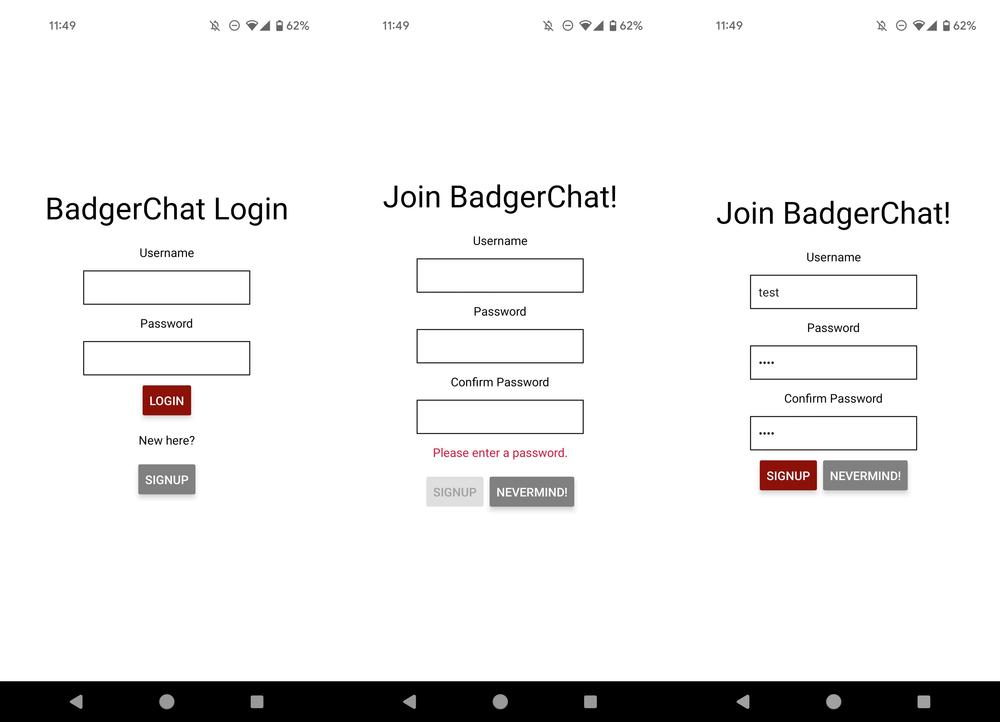
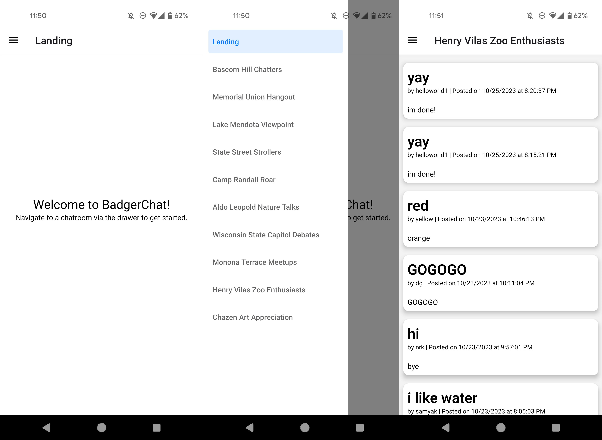
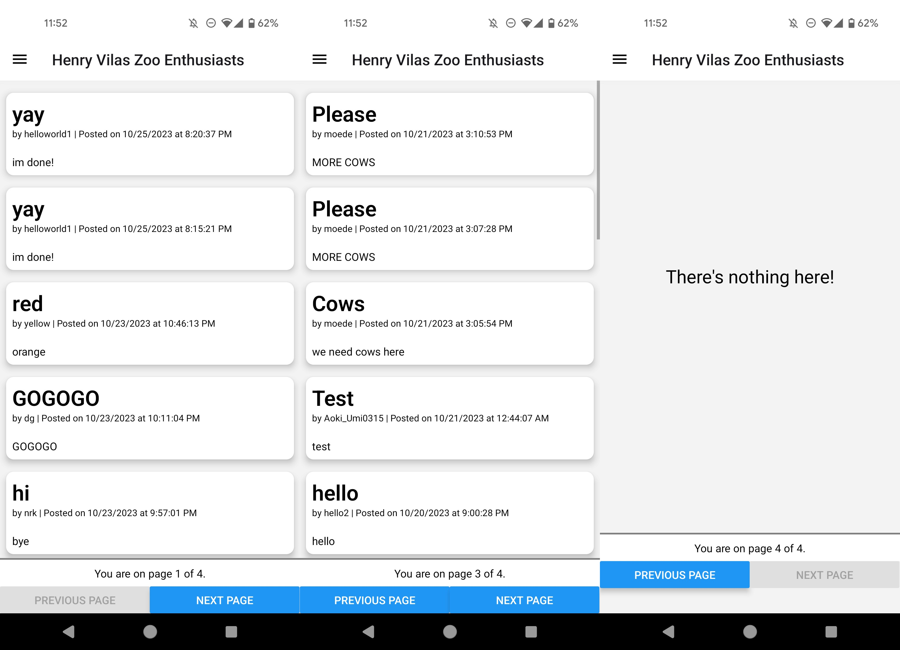
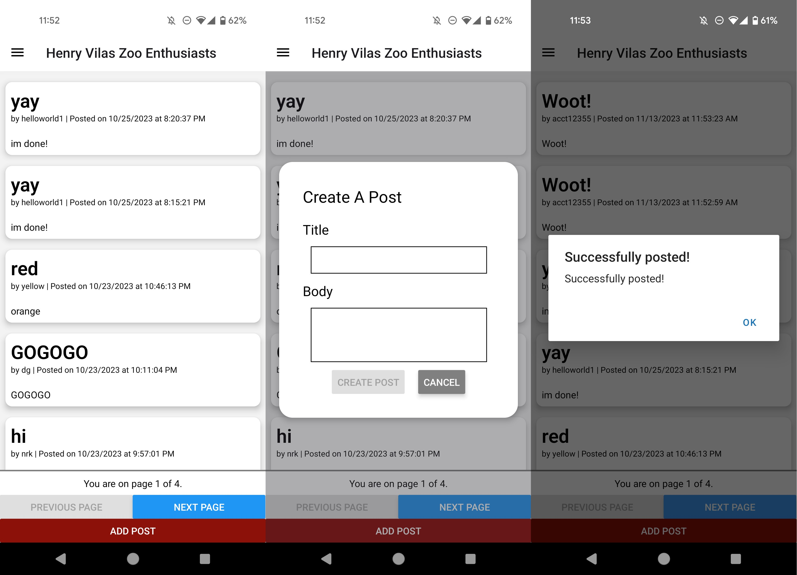
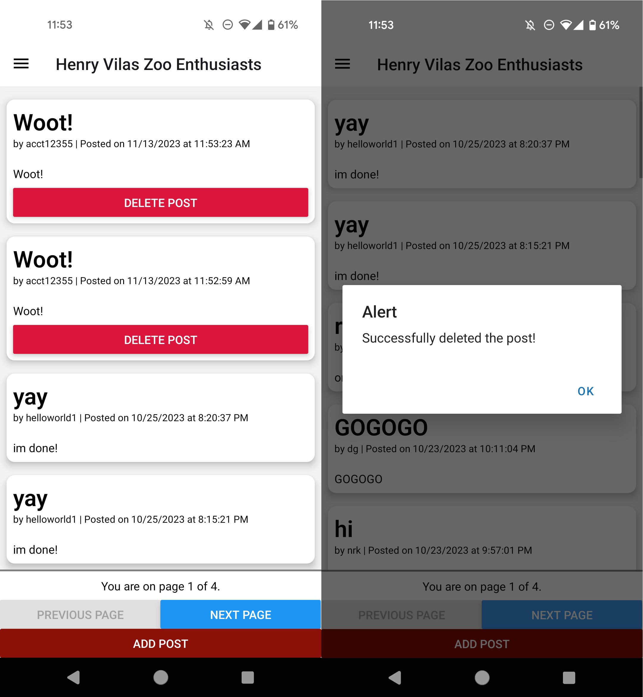
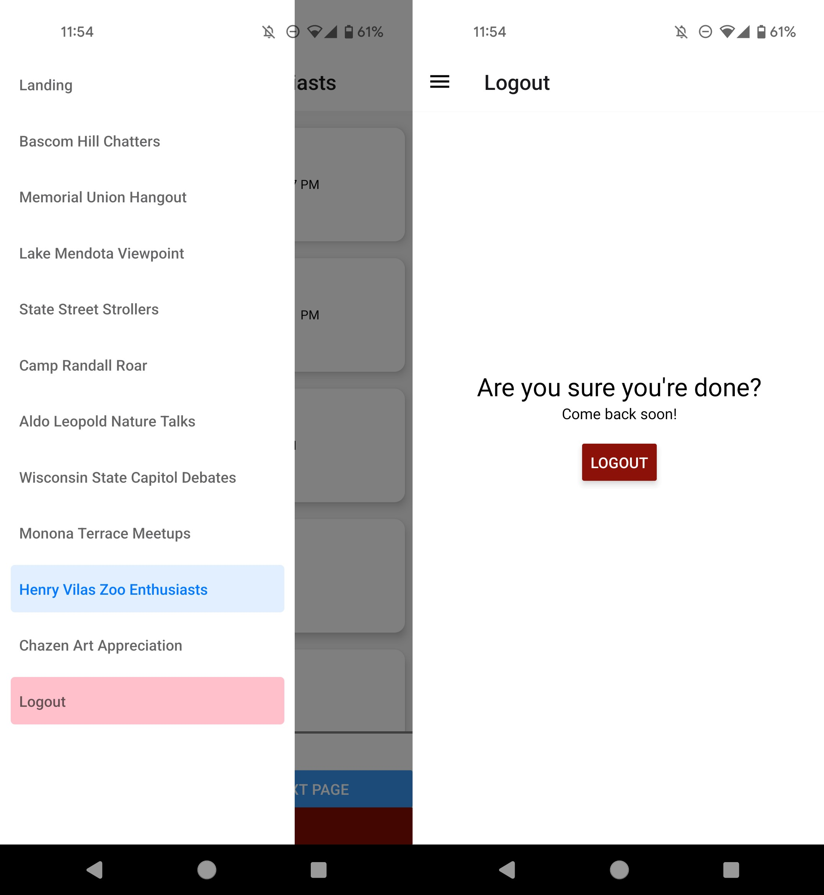
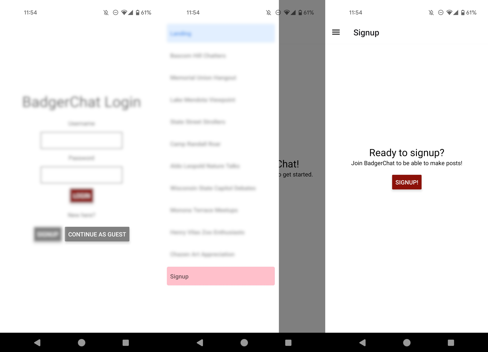

# CS571-F23 HW9: BadgerChat

Welcome back to BadgerChat! For this assignment, you will re-implement BadgerChat as *a mobile application*.

## BadgerChat

The starter code provided to you was generated using [expo](https://expo.dev/) and all the necessary libraries for [react navigation](https://reactnavigation.org/) and [expo-secure-store](https://www.npmjs.com/package/expo-secure-store) have already been added. See the `package.json` for details. **You should *not* re-run the expo init command**. Instead, in this directory, simply run...

```bash
npm install
npm start
```

To test your app, you have a few options. If you have a smart device, I would recommend using the expo app for [iOS](https://apps.apple.com/us/app/expo-go/id982107779) or [Android](https://play.google.com/store/apps/details?id=host.exp.exponent&hl=en_US&gl=US). You can scan the QR code using your phone, or you can launch commands via the terminal. Otherwise, you can use an emulator (such as [AVD](https://developer.android.com/studio/run/emulator)). Do not use the web browser to test your code; you must test on Android or iOS!

Note that we are writing code in JavaScript for React Native; if you begin writing code in Objective-C, Swift, Java, or Kotlin you are likely doing something *very* wrong!

### API Notes

All routes are relative to `https://cs571.org/api/f23/hw9/`.

 - **This API has similar endpoints to HW6.**
 - **This API shares the same database as HW6.**
 - **This API uses the `Authorization` header instead of cookies.**
 - **This API does NOT have a logout endpoint.**

A brief overview of the API is provided below. Further details can be found in `API_DOCUMENTATION.md`.

| Method | URL | Purpose | Return Codes |
| --- | --- | --- | --- |
| `GET`| `/chatrooms` | Get all chatrooms. | 200, 304 |
| `GET` | `/messages?chatroom=NAME&page=NUM`| Get latest messages for specified chatroom and page. | 200, 400, 404 |
| `POST` | `/messages?chatroom=NAME` | Posts a message to the specified chatroom. | 200, 400, 404, 413 |
| `DELETE` | `/messages?id=ID` | Deletes the given message. | 200, 400, 401, 404 |
| `POST` | `/register` | Registers a user account. | 200, 400, 409, 413  |
| `POST` | `/login` | Logs a user in. | 200, 400, 401 |
| `GET` | `/whoami` | Gets details about the currently logged in user. | 200 |

**When making API calls with a request body, don't forget to include the header `"Content-Type": "application/json"`**

### 1. Login & Register
Provide a login screen that allows the user to login with an existing username and password. Upon an incorrect password, display something along the lines of "Incorrect login, please try again."

Furthermore, provide a registration screen. This screen should allow the user to register an account with a username, password, and repeated password. A warning should be shown that says "Please enter a password" when a password is missing and "Passwords do not match" when the passwords do not match. This can either be done in real-time or upon clicking "register". Upon registration, if the username is already taken, inform the user.

The user should be able to switch back and forth between the login and registration screens using the informal "switch" navigation. Upon *either* logging in or registering, the user should be directed to the BadgerChat landing page.

**You must use expo-secure-store to store the JWT.** You may also find it helpful to store the username later.

**Passwords should be masked with stars**, see the [TextInput documentation](https://reactnative.dev/docs/textinput).



### 2. Display Chatrooms and Messages

After the user has successfully logged in, they should be routed to a landing page. On this landing page, the user should be able to access a drawer that will allow them to navigate to the different chatrooms of BadgerChat. Each chatroom should display the messages for that chatroom, including the message's title, author, content, and posting date (**hint:** a component `BadgerChatMessage.jsx` has already been created for you). You will paginate this in the next step.

**You must use React Navigation for this requirement.**



### 3. Paginate Chat Messages

In addition, the user should be able to switch between pages in a chatroom. There are exactly 4 pages to every chatroom; you may hardcode this number. While you do not need individual pagination items (e.g. 1, 2, 3, and 4), you must have "previous" and "next" buttons to flip through the pages. The "previous" button must be disabled on the first page, and the "next" button must be disabled on the last page. If a page does not have any posts, simply display "There's nothing here!" as well as the pagination buttons.

You must show the user what page they are on at all times.

**Optional:** You may choose to handle this [via gestures](https://docs.swmansion.com/react-native-gesture-handler/docs/) (e.g. swiping left and right) instead, though this is not a requirement.



### 4. Create a Post

The user should be able to create a post in a particular chatroom. This should be achieved by using a [modal](https://reactnative.dev/docs/modal). The modal should have a field for both the title and body of the post as well as buttons to create the post or cancel. If the post is lacking either a title or body, the "create post" button should be disabled.

Upon posting, the user should see an `Alert` notifying them that their post was successful as well as the *updated* message board, reverting back to the first page.

**Remember:** Because the phone is not a browser, we no longer use cookies! Instead, we must manually specify the header `Authorization: Bearer <JWT>` where `<JWT>` is the token that was stored using `expo-secure-store`.



### 5. Delete a Post

Add the option for a user to delete *their own* posts. A red "Delete" button should be shown for each post that a user owns (but not for others' posts).

Upon deleting a post, the user should see an `Alert` notifying them that their post was deleted as well as the *updated* message board, reverting back to the first page.



### 6. Logout

Add a navigation screen to the drawer for the user to logout. Upon logout, the JWT should be deleted from the secure store and the user should be re-routed to the login screen.

**Note:** In this API, because we are no longer using cookies, there is not a logout endpoint. You just need to remove the JWT from the secure store on your device.



### 7. Anonymous Access

BadgerChat is a public forum, so users should be able to view posts without an account. Add a "Continue As Guest" option to the login screen. When continuing as guest, the user should be able to view posts, but not add a post. Furthermore, instead of logging the user out, re-route them **to the signup screen** -- we will try to [convert our guest into a user](https://seodigitalgroup.com/what-is-a-conversion/).



### Other Notes
You should now be able to interact with BadgerChat through both your phone and the web! 🥳

### Submission Details
In addition to your code, **you will also need to submit a video recording of your app**. Like the demo video, it should cover all the tasks below. Please thoroughly demonstrate all tasks to showcase the capabilities of your app.

**Please embed your recording as a Kaltura video as a part of the assignment submission.**

#### Tasks 
 1. Try to register for an account that already exists.
 2. Register for a new account.
 3. Logout.
 4. Login with an *incorrect* password.
 5. Login with a *correct* password.
 6. Browse two different chatrooms and browse through all of the pages of at least 1 of the chatrooms.
 7. Create a post and show that it has been added.
 8. Delete a post and show that it has been removed.
 9. Logout.
 10. Continue as a guest.
 11. Visit a chatroom.
 12. Return to signup.
