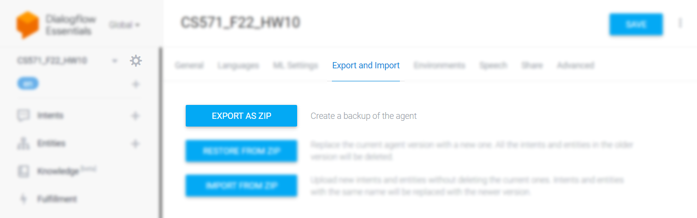
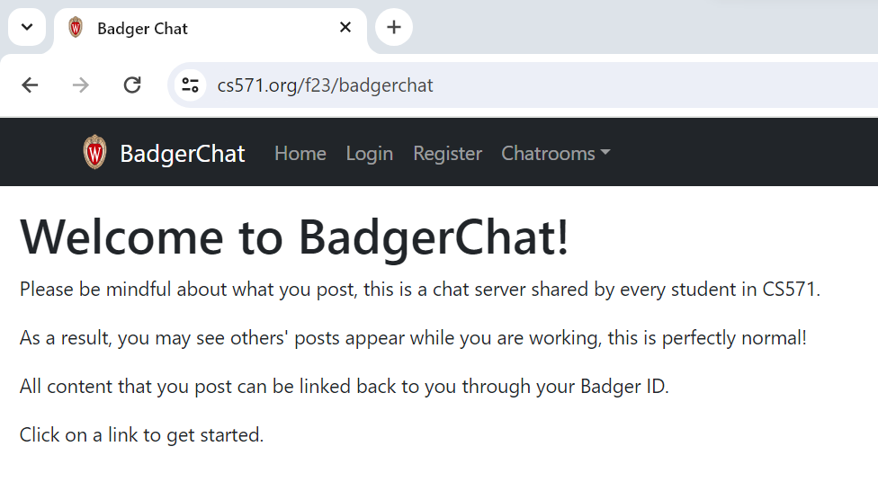
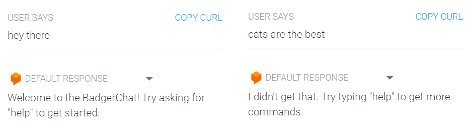
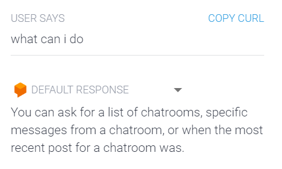
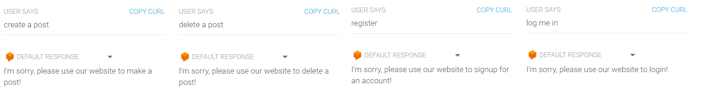
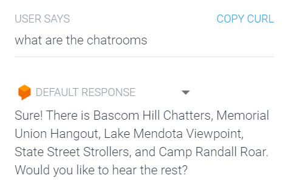
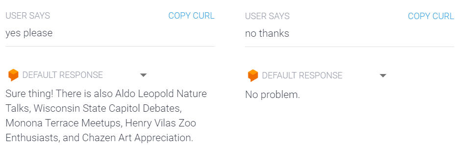
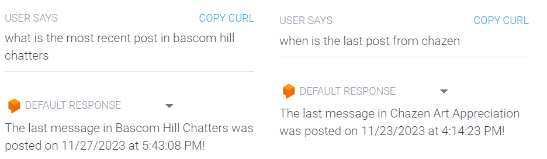
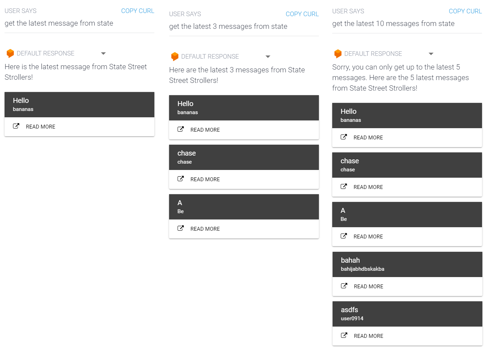

# CS571-F23 HW11: BadgerChat

Welcome back to our final installment of BadgerChat! For this assignment, you will re-implement BadgerChat as *a voice application*. By completing this class, you will have developed a web, mobile, and voice interface for BadgerChat! 🥳🎉  While it is not a requirement, you should also consider how you would *assess* your voice interface using what we learned in *usability evaluation*.

## BadgerChat

You will complete a [DialogFlow Agent](https://dialogflow.cloud.google.com/) and a webhook as a part of this assignment. Your DialogFlow agent will act as a sort of "frontend" which communicates between the user and this webhook, and this webhook will act as a sort of "midend" which communicates with the BadgerChat API.

The webhook starter code provided to you is an [express](https://expressjs.com/) server outfitted with [morgan](https://www.npmjs.com/package/morgan) for logging, [nodemon](https://nodemon.io/) for hot-reloading, and [ngrok](https://ngrok.com/) for publishing.

You will need to create your DialogFlow agent at [dialogflow.cloud.google.com](https://dialogflow.cloud.google.com/). When you are finished, you will export your DialogFlow agent as a `.zip` by clicking the settings icon > Export and Import > Export as Zip. Include this zip as a file in your GitHub Classroom submission.




### Setup

#### **Setup DialogFlow Agent**

You will need to create your DialogFlow agent at [dialogflow.cloud.google.com](https://dialogflow.cloud.google.com/). Be sure that you are using **DialogFlow ES**.

#### **Setup Webhook**

First, run `npm install` in this directory.

Then, [register for an ngrok account](https://ngrok.com/).

Finally, place your [ngrok auth token](https://dashboard.ngrok.com/get-started/your-authtoken) in a file called `token.secret`. This file will *not* be committed.

### Running

#### **Running Webhook**

Open **two terminals**. In one terminal, run `npm start`. In your second terminal, run `npm run tunnel`.

`npm start` will start your application while `npm run tunnel` publishes your server to the world. You can check that the webhook is running by visiting both `http://localhost:53705` and your ngrok url. A message should be displayed that says "Express Server Works!"

**Note:** You may get a warning when visiting the ngrok url in your browser; this is okay! It is a security feature.

#### **Running DialogFlow Agent**

Simply open [dialogflow.cloud.google.com](https://dialogflow.cloud.google.com/) and enter a query into the prompt. For intents that require a webhook, you will have to paste your ngrok url into the "Fulfillment" section of DialogFlow. Make sure to press "Save". **This url will change each time you run `npm run tunnel`!**

### API Notes

All data can be retrieved via API calls to `https://cs571.org/api/f23/hw11/`.

This has the **exact same** endpoints as HW6 and shares the same database. For complete documentation, see `API_DOCUMENTATION.md`

| Method | URL | Purpose | Return Codes |
| --- | --- | --- | --- |
| `GET`| `/chatrooms` | Get all chatrooms. | 200, 304 |
| `GET` | `/messages?chatroom=NAME&page=NUM`| Get latest messages for specified chatroom and page. | 200, 400, 404 |
| `POST` | `/messages?chatroom=NAME` | Posts a message to the specified chatroom. | 200, 400, 404, 413 |
| `DELETE` | `/messages?id=ID` | Deletes the given message. | 200, 400, 401, 404 |
| `POST` | `/register` | Registers a user account. | 200, 400, 409, 413  |
| `POST` | `/login` | Logs a user in. | 200, 400, 401 |
| `POST` | `/logout` | Logs the current user out. | 200 |
| `GET` | `/whoami` | Gets details about the currently logged in user. | 200 |

An unexpected server error `500` *may* occur during any of these requests. It is likely to do with your request. If the error persists, please contact a member of the course staff.

## BadgerChat Voice

### 0. Setup Work

In addition to pasting your ngrok token into a file called `token.secret`, you will also need to have access to [BadgerChat Web](https://www.cs571.org/f23/badgerchat). If you see the home page of BadgerChat Web, great -- there is nothing more you need to do for this step! Otherwise, you will need to [login with your Badger ID](https://www.cs571.org/auth/login) before continuing. This may take restarting your browser as well.



### 1. Default Welcome and Fallback Intents

When the user says something along the lines of "hi" or if the user is lost, direct them to ask for help. We will make this intent in Step 2.

You may hardcode your response in the DialogFlow agent, **you do not need a webhook for this intent.**



### 2. Help User Intent

Create a "HelpUser" intent. If the user asks for help, give them a list of things they will be able to do: ask for a list of chatrooms, specific messages from a chatroom, or when the most recent post for a chatroom was.

You may hardcode your response in the DialogFlow agent, **you do not need a webhook for this intent.**



### 3. Stub Create, Delete, Register, and Login Intents

BadgerChat Voice will be very limited; the user will not be able to do any authenticated action. Instead, if the user requests to create a post, to delete a post, to register a user, or to login as a user, simply refer them to the website instead. I would recommend creating a separate intent for each one of these actions.

You may hardcode your responses in the DialogFlow agent, **you do not need a webhook for these intents.**



### 4. Chatroom Names Intent

When the user asks what chatrooms are available, return a list of the first five chatroom names...

 - Bascom Hill Chatters
 - Memorial Union Hangout
 - Lake Mendota Viewpoint
 - State Street Strollers
 - Camp Randall Roar

Additionally, ask the user if they would like to hear more. We will cover this in Step 5.

You may hardcode your response in the DialogFlow agent, **you do not need a webhook for this intent.**



### 5. Chatroom Names Followup Intent

Add "yes" and "no" followup intents for your intent above. If the user responds with "yes", return a list of the last five chatroom names...

 - Aldo Leopold Nature Talks
 - Wisconsin State Capitol Debates
 - Monona Terrace Meetups
 - Henry Vilas Zoo Enthusiasts
 - Chazen Art Appreciation.

If the user responds with "no", gracefully respond with "no worries" or the like.

In either case, the context should be removed after responding. This can be achieved by giving it an initial lifespan of 1.

You may hardcode your responses in the DialogFlow agent, **you do not need a webhook for these followup intents.**



### 6. Get Date & Time of Recent Post

The user should be able to get when the most recent post was posted for a particular chatroom, e.g.

```
U: When was the latest post in Lake Mendota Viewpoint?
A: The last message in Lake Mendota Viewpoint was posted on 11/27/2023 at 2:39:45 PM!
```

```
U: Get me when latest post was in camp
A: The last message in Camp Randall Roar was posted on 11/27/2023 at 3:57:25 PM!
```

You will need to create a DialogFlow entity for the chatroom name. For each chatroom name, also add a synonym of the first word, e.g. "State Street Strollers" can also go by "State".

**You will need webhook fulfillment to complete this intent**. Use a text response to display this information. You may assume that every chatroom will have some messages; you do not need to handle the case where the chatroom is empty. Additionally, you may use the [Date](https://developer.mozilla.org/en-US/docs/Web/JavaScript/Reference/Global_Objects/Date) object's `toLocaleDateString` and `toLocaleTimeString` -- we won't worry about timezone differences in this assignment.

**You must use `async`/`await` syntax!** Do not use `.then`.



### 7. Get Posts Intent
The user should be able to read a number of posts that are in the chatroom they specify. They must specify a chatroom name, but if they do not specify a number of posts, assume they only want to view the 1 latest post. If they specify that they want to see more than 5 posts, show them *at most* the 5 latest posts.

Use a [card response](https://cloud.google.com/dialogflow/es/docs/fulfillment-webhook#card_response) to display the post's title and author. Furthermore, include a button that will allow the user to read more posts in the chatroom. When the user clicks this button, direct them to that chatroom on [BadgerChat Web](https://www.cs571.org/f23/badgerchat), e.g. [https://www.cs571.org/f23/badgerchat/chatrooms/Camp%20Randall%20Roar](https://www.cs571.org/f23/badgerchat/chatrooms/Camp%20Randall%20Roar)

**You will need webhook fulfillment to complete this intent.** You will use the BadgerChat API to *get* the latest posts, and you will *direct* the user to `https://cs571.org/f23/badgerchat/chatrooms/CHATROOM_NAME/` to view the post in greater detail.

**You must use `async`/`await` syntax!** Do not use `.then`.



### Other Notes
**You should include multiple training phrases (aim for 3+) for each intent.** However, you do not need multiple responses for your intents; one response will do.

**You must use `async`/`await` syntax!** Do not use `.then`.

### Submission Details
In addition to your code, **you will also need to submit a video recording of your app**. Like the demo video, it should cover all the tasks below. Please thoroughly demonstrate all tasks to showcase the capabilities of your app.

**Please embed your recording as a Kaltura video as a part of the assignment submission.** You may find [Zoom](https://support.zoom.us/hc/en-us/articles/201362473-Enabling-and-starting-local-recordings) helpful for recording your screen.

#### Tasks 
 - Show the welcome intent
 - Show the fallback intent
 - Show the help intent
 - Show that the user cannot...
   - create a message
   - delete a message
   - register a user
   - login as a user
 - Show the chatroom names intent
   - ... and say "no" to seeing the rest
   - ... ask again and this time say "yes" to seeing the rest
 - Show when the most recent message was in a chatroom
   - ...as well as a different chatroom
 - Show the get posts intent...
   - ... for no specified number of posts
   - ... for 3 posts
   - ... for >5 posts
   - ... also show the chatroom opening in a new page
