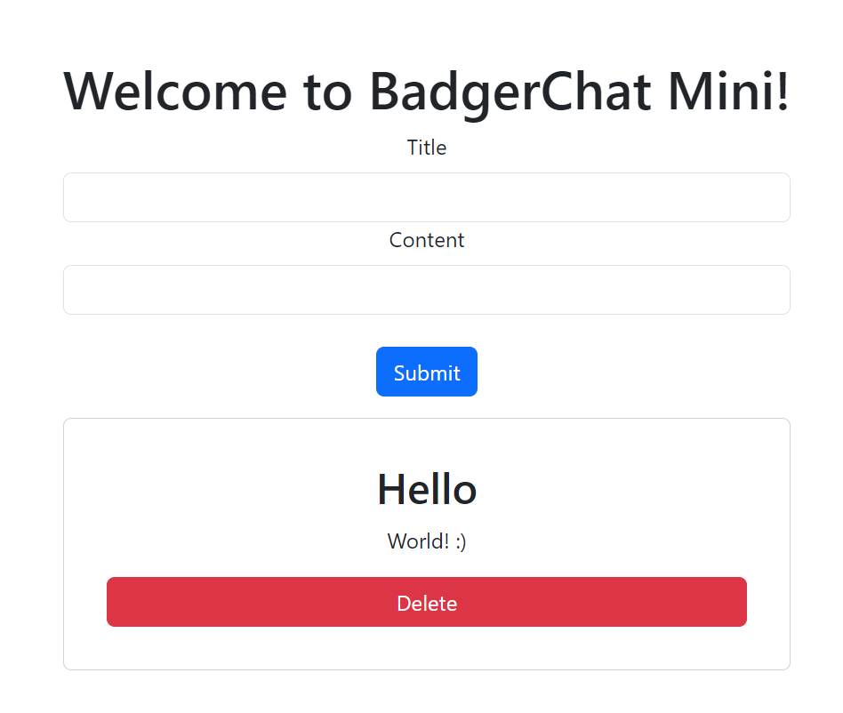

# CS571-F23 HW12: BadgerChat Mini

Welcome back to our final, *final* installment of BadgerChat! For this assignment, you will create both the *frontend* and *backend* of a miniature version of BadgerChat. By completing this class, you will not only have developed a web, mobile, and voice interface for BadgerChat, but also know a bit of the backend programming for it! 🥳🎉

### Setup

I *highly* recommend re-watching our in-class demo as this HW builds off the work done in class.

In one terminal, run...

```bash
cd frontend
npm install
npm run dev
```

In another terminal, run...

```bash
cd backend
npm install
npm run dev
```

Both the frontend and backend will hot-reload your changes.

### 1. Delete a Post

There is only one requirement for this assignment -- introduce the *frontend* and *backend* capability to delete a post. You will *not* be working with a CS571 API -- you'll be working with your own API!

On the frontend, a "delete post" button should fetch `DELETE` `http://localhost:53706/api/messages/MESSAGE_ID` where `MESSAGE_ID` is the unique ID for that post. On the backend, this should remove that message from the database.

On the frontend, you should *reload* the latest messages after the deletion is complete.

On the backend, you do *not* need to check if the message exists first. Furthermore, you do *not* need to do anything with the Dockerfile or CORS configuration -- these are just for your reference!



Finally, you do *not* need to demo your code. Once complete, **add, commit, and push your changes to GitHub.** Congratulations on completing your final project for CS571! 🥳🎉